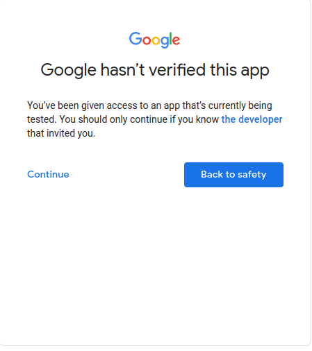

<!-- PROJECT HEAD -->
<br />

  <h1 align="center">CONVIN ASSIGNMENT</h1>

  <p align="center">
    In this assignment you have to implement google calendar
    integration using django rest api. You need to use the OAuth2 mechanism to
    get users calendar access. Below are detail of API endpoint and
    corresponding views which you need to implement
  </p>
  <p align="center">
    /rest/v1/calendar/init/ -> GoogleCalendarInitView()
    This view should start step 1 of the OAuth. Which will prompt user for
    his/her credentials
   </p>
  <p align="center">
    /rest/v1/calendar/redirect/ -> GoogleCalendarRedirectView()
    This view will do two things
    1. Handle redirect request sent by google with code for token. You
    need to implement mechanism to get access_token from given
    code
    2. Once got the access_token get list of events in users calendar
   </p>
You need to write the code in Django. You are not supposed to use any
existing third-party library other then google’s provided standard libraries
Please create a GitHub repo and upload code there. Looking forward to your
submission. Have a great day <br> <br>
  <p align="center">
Thank You
    <br />
    <br />
    <a href="https://github.com/amjadcp/Convin-Assignment/issues">Report Bug</a>
    ·
    <a href="https://github.com/amjadcp/Convin-Assignment/issues">Request Feature</a>
  </p>

 <br>
 <br>
 <br>
 <br>


<!-- GETTING STARTED -->
## Getting Started

This is an example of how you may give instructions on setting up your project locally.
To get a local copy up and running follow these simple example steps.

### Prerequisites

This is an example of how to list things you need to use the software and how to install them.

### To use

1. Clone the repo
   ```sh
   git clone https://github.com/amjadcp/Convin-Assignment.git
   ```
2. Enter to the repo
   ```sh
   cd Convin-Assignment
   ```
3. Create a virtual environment
   ```sh
   python3 -m venv venv
   ```
4. Activate virtual environment
   ```sh
   source venv/bin/activate
   ```
5. Install whole dependencies
   ```sh
   pip install -r requirements.txt
   ```
6. Run server and open in [127.0.0.1:8080](http://127.0.0.1:8000/)
   ```sh
   python manage.py runserver
   ```


<!-- CONTRIBUTING -->
## Contributing

Contributions are what make the open source community such an amazing place to be learn, inspire, and create. Any contributions you make are **greatly appreciated**.

1. Fork the Project
2. Create your Feature Branch (`git checkout -b feature/AmazingFeature`)
3. Commit your Changes (`git commit -m 'Add some AmazingFeature'`)
4. Push to the Branch (`git push origin feature/AmazingFeature`)
5. Open a Pull Request


<!-- LICENSE -->
## License

Distributed under the MIT License. See `LICENSE` for more information.


<!-- project link -->
## Project Link

Project Link: [https://github.com/amjadcp/bookingLine-grpA-miniProject](https://github.com/amjadcp/Convin-Assignment)

